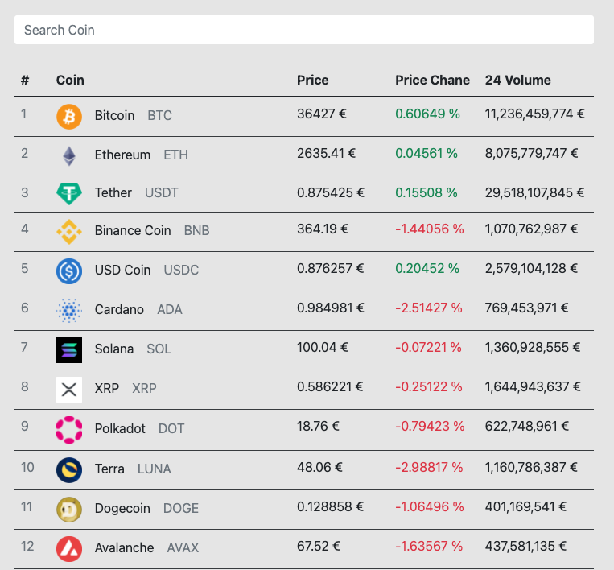
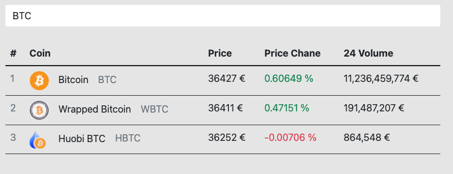

# Exeno Interview Task - Coin Select App

Twoim zadaniem jest zrobienie aplikacji Frontend do przeglądania listy kryptowalut.

## Funkcjonalności

Aplikacja powinna się składać z następujących funkcjonalności: 

### Ekran Główny

Ekran główny powinien wyświetlić listę pobranych kryptowalut. Listę kryptowalut możesz pobrać z tego endpoint-a: `https://api.coingecko.com/api/v3/coins/markets?vs_currency=eur&order=market_cap_desc&per_page=100&page=1&sparkline=false`

Sama prezentacja listy powinna wyglądać mniej więcej w ten sposób:

Powyżej listy kryptowalut powinien znajdować się input pozwalający na filtrowanie bieżącej listy kryptowalut po nazwie lub symbolu ("bitcoin" i "btc" powinny wyświetlać Bitcoin-a)

Poniżej listy kryptowalut powinna znajdować się paginacja, która za pomocą parametrów `per_page` i `page` pozwoli poruszać się w przód i tył listy kryptowalut.

### Ekran Szczegółów kryptowaluty

Po kliknięciu na wiersz listy, powinno nastąpić przeniesienie użytkownika do oddzielnego ekranu gdzie bedą prezentowane szczegóły danej kryptowaluty pobrane za pomocą endpointa: `https://api.coingecko.com/api/v3/coins/ethereum`

Na ekranie szczegółów danej kryptowaluty powinny zostać wyświetlone takie informacje jak: 
- Nazwa kryptowaluty
- Symbol kryptowaluty
- Logo kryptowaluty
- Adres strony kryptowaluty
- Rok powstania kryptowaluty
- Opis kryptowaluty w języku angielskim

## Proponowany stack technologiczny: 

- [Vue.js](https://vuejs.org/)
- [Axios](https://axios-http.com/)
- [Sass](https://sass-lang.com/)

Jeżeli masz inne propozycje dotyczące wyboru technologicznego, to chętnie zobaczymy rozwiązanie w wybranych przez Ciebie technologiach.

## Sposób dostarczenia zadania

Zadanie proszę dostarczyć w formie publicznego repozytorium na Github / Gitlab.